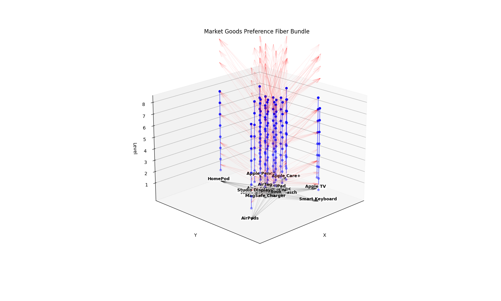

# Market Goods Preference Fiber Bundle

[English](README.md) | [繁體中文](README_zh.md)

Example 1:


Example 2:


This project implements a special mathematical structure: a fiber bundle with directed graphs as the base space and integer groups (Z) as fibers, applied to modeling market goods preference relationships.

## Mathematical Structure

### 1. Basic Elements

#### 1.1 Base Space
- Uses directed graph G = (V,E) as base space
- V represents the set of market goods (e.g., MacBook, iPad, AirPods)
- E represents preference relationships between goods
- Each node v ∈ V has an integer-valued fibration level l(v) ∈ Z, representing the quantity of individual goods
- Edge direction follows partial ordering: if l(v₁) > l(v₂), then there exists a directed edge (v₁, v₂) ∈ E

#### 1.2 Fiber
- Each product node v has an integer group Z attached as fiber F_v
- F_v ≅ Z represents the purchase quantity of that product
- Due to the assumption that more quantity is preferred, it also forms a partial order structure

#### 1.3 Total Space
- Total space E is the union of all fibers: E = ⋃_{v∈V} F_v
- Equipped with projection mapping π: E → G
- π^{-1}(v) ≅ Z holds for each v ∈ V

### 2. Connection Structure

#### 2.1 Local Trivialization
- For each node v, there exists a homeomorphism φ_v: π^{-1}(U_v) → U_v × Z
- U_v is the neighborhood of v
- This ensures local consistency of utility comparisons

#### 2.2 Connection Mapping
- Order-preserving linear transformations defined as connections between adjacent products
- For edge e = (v₁, v₂) ∈ E, connection mapping φ_e: F_{v₁} → F_{v₂}
- φ_e(z) = az + b_e, where:
  - z represents original utility value
  - a is a positive real number (ensuring order preservation)
  - b_e is integer translation (representing utility difference between products)
- Order preservation: if z₁ > z₂, then φ_e(z₁) > φ_e(z₂)
- This linear mapping allows natural partial ordering between discrete points on different fibers

#### 2.3 Compatibility Conditions
- For any path γ = (e₁, ..., e_n), composite mapping satisfies:
  - φ_{e_n} ∘ ... ∘ φ_{e₁} = φ_γ
- This ensures consistency in cross-product utility comparisons

### 3. Economic Interpretation

#### 3.1 Preference Structure
- Directed edges in base space represent preference relationships between products
- Fibration levels reflect basic value ordering of products
- Fiber space represents concrete utility quantification

#### 3.2 Utility Mapping
- Vertical fibers represent utility range of individual products
- Connection mappings describe utility conversion relationships between different products
- Order preservation ensures preference transitivity

### 4. Implementation Features

#### 4.1 Data Structure
- Uses NetworkX's DiGraph for product relationship network
- Node attributes:
  - name: product name
  - level: fibration level
  - fiber_range: utility value range
- Edge attributes:
  - a: linear mapping coefficient
  - b: translation value
  - connection_type: connection type

#### 4.2 Visualization Features
- Vertical line segments in 3D space represent utility spaces of products
- Arrows in base plane represent preference relationships between products
- Red connection lines represent mappings between utility spaces

## Mathematical Inference

### 1. Relationship with Traditional Utility Theory

#### 1.1 Limitations of Traditional Utility Theory
- Traditional utility theory assumes continuous utility function u: X → ℝ
- Requires complete comparability of preferences (completeness)
- Assumes utility values can vary continuously in real domain

#### 1.2 Generalization through Fiber Bundle Structure
- Relaxes completeness assumption:
  - Directed graph structure in base space allows partial order relations
  - Not all products need to be directly comparable
- Discretizes continuous utility values:
  - Replaces real domain ℝ with integer group Z
  - Better matches discrete nature of actual purchasing behavior
- Localizes utility comparisons:
  - Implements local utility conversions through fiber connections
  - Avoids requirement for global utility function existence

### 2. Mathematical Equivalence Proof

#### 2.1 Degeneration in Special Cases
The structure degenerates to traditional utility theory under the following conditions:
1. Base space is a complete graph (edges between all nodes)
2. All connection mappings are commutative: φ_{e₁} ∘ φ_{e₂} = φ_{e₂} ∘ φ_{e₁}
3. Global consistent linear coefficient exists with a = 1

Theorem: Under these conditions, there exists a global utility function u: V → Z such that:
- ∀v₁, v₂ ∈ V, v₁ ≻ v₂ ⟺ u(v₁) > u(v₂)
- ∀e = (v₁, v₂) ∈ E, φ_e(z) = z + (u(v₂) - u(v₁))

#### 2.2 Topological Characteristics
1. Overall structure forms hierarchical fiber bundle:
   - π: E → G is locally trivial fiber bundle
   - Structure group is integer addition group (Z, +)
   - Each fiber is homeomorphic to Z

2. Compatibility conditions equivalent to flat connection:
   - Curvature vanishes: R(X,Y) = 0
   - Corresponds to path independence of utility comparisons

### 3. Theoretical Advantages

#### 3.1 Topological Invariants
- Enables definition of homology groups for preference structure
- Studies preference stability through persistent homology
- Characteristic classes of fiber bundle reflect global structural obstacles

#### 3.2 Discretization Benefits
1. Better matches reality:
   - Product quantities naturally integer-valued
   - Utility comparisons typically discrete
2. Computational advantages:
   - Avoids numerical errors from continuity
   - Facilitates computer implementation

#### 3.3 Localization Principle
1. Decomposes global utility comparisons into local ones
2. Ensures consistency of local comparisons through connection structure
3. Enables utility comparisons in incomplete markets

### 4. Application Extensions

#### 4.1 Incomplete Market Analysis
- Handles market structures with incomplete information
- Studies transition from local to global equilibrium
- Analyzes market segmentation effects

#### 4.2 Consumer Behavior Models
- Describes decision processes under bounded rationality
- Simulates choice behavior based on local comparisons
- Studies dynamic evolution of preference structures

## Usage

### Installation
```bash
pip install networkx matplotlib numpy
```

### Basic Usage
```python
# Create fiber bundle
bundle = FibrationBundle(base_nodes=6, fibration_levels=3, fiber_height=5)

# Visualize
bundle.visualize()

# Check compatibility
is_compatible = bundle.check_compatibility()
```

### Parameters
- `base_nodes`: number of nodes in base space
- `fibration_levels`: number of fibration levels
- `fiber_height`: visualization height of fibers
- `connection_params`: connection mapping parameter configuration
  - `a`: linear coefficient
  - `b`: translation value
  - `type`: mapping type

## Theoretical Applications

This structure can be used for:
1. Mathematical modeling of market goods preference relationships
2. Discrete representation of consumer utility theory
3. Topological analysis of product value networks
4. Homological study of market structures

## Future Extensions

1. Introduce nonlinear connection mappings to describe more complex preference relationships
2. Compute persistent homology of preference networks
3. Add time dimension to study preference dynamics
4. Implement market equilibrium analysis based on fiber bundle structure
5. Develop product recommendation algorithms based on fiber bundles
6. Study the impact of different connection mapping types on preference structure
7. Implement adaptive connection parameter optimization
