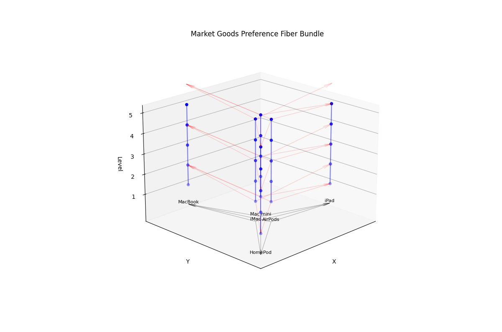

# Market Goods Preference Fiber Bundle

[English](README.md) | [繁體中文](README_zh.md)

Example 1:


Example 2:


這個專案實現了一個特殊的數學結構：以有向圖為基底空間，整數群(Z)為纖維的纖維叢(Fiber Bundle)結構，並應用於市場商品偏好關係的建模。

## 數學結構說明

### 1. 基本元素

#### 1.1 基底空間 (Base Space)
- 採用有向圖(Directed Graph) G = (V,E) 作為基底空間
- V 表示市場商品集合（如：MacBook, iPad, AirPods 等）
- E 表示商品間的偏好關係
- 每個節點 v ∈ V 都具有整數值的纖維化層級 l(v) ∈ Z, 表示了個別商品的購買數量
- 邊的方向遵循偏序關係：若 l(v₁) > l(v₂)，則存在有向邊 (v₁, v₂) ∈ E

#### 1.2 纖維 (Fiber)
- 每個商品節點 v 上都附著一個整數群 Z 作為纖維 F_v
- F_v ≅ Z 表示該商品的購買數量
- 由於個別商品的購買數量符合越多越好的偏好假設,所以也是一個偏序結構

#### 1.3 總空間 (Total Space)
- 總空間 E 是所有纖維的聯集：E = ⋃_{v∈V} F_v
- 配備投影映射 π: E → G
- π^{-1}(v) ≅ Z 對每個 v ∈ V 成立

### 2. 聯絡結構 (Connection Structure)

#### 2.1 局部平凡化
- 對每個節點 v，存在同胚 φ_v: π^{-1}(U_v) → U_v × Z
- U_v 是 v 的鄰域
- 這確保了效用比較的局部一致性

#### 2.2 聯絡映射
- 在相鄰商品之間定義了保序線性變換作為聯絡
- 對於邊 e = (v₁, v₂) ∈ E，聯絡映射 φ_e: F_{v₁} → F_{v₂}
- φ_e(z) = az + b_e，其中：
  - z 表示原始效用值
  - a 為正實數（保證保序性）
  - b_e 為整數平移量（表示商品間的效用差異）
- 保序性：若 z₁ > z₂，則 φ_e(z₁) > φ_e(z₂)
- 這種線性映射允許不同纖維上的離散點建立自然的偏序關係

#### 2.3 相容性條件
- 對於任意路徑 γ = (e₁, ..., e_n)，複合映射滿足：
  - φ_{e_n} ∘ ... ∘ φ_{e₁} = φ_γ
- 這確保了跨商品效用比較的一致性

### 3. 經濟學解釋

#### 3.1 偏好結構
- 基底空間的有向邊表示商品間的偏好關係
- 纖維化層級反映商品的基礎價值排序
- 纖維空間表示具體的效用量化

#### 3.2 效用映射
- 垂直纖維表示單個商品的效用範圍
- 聯絡映射描述不同商品間的效用轉換關係
- 保序性確保偏好的遞移性

### 3.3 與傳統效用理論的關係

#### 3.3.1 傳統效用理論的局限
- 傳統效用理論假設存在連續的效用函數 u: X → ℝ
- 要求偏好關係完全可比較（完備性）
- 假設效用值可以在實數域上連續變化

#### 3.3.2 纖維叢結構的推廣
- 放寬了完備性假設：
  - 基底空間的有向圖結構允許部分序關係
  - 不要求所有商品都可以直接比較
- 將連續效用值離散化：
  - 用整數群 Z 替代實數域 ℝ
  - 更符合實際購買行為的離散特性
- 局部化效用比較：
  - 通過纖維間的聯絡映射實現局部效用轉換
  - 避免了全局效用函數的存在性要求

#### 3.3.3 數學等價性證明

##### 3.3.3.1 特殊情況下的退化
當滿足以下條件時，本結構退化為傳統效用理論：
1. 基底空間為完全圖（所有節點間都有邊）
2. 所有聯絡映射可交換：φ_{e₁} ∘ φ_{e₂} = φ_{e₂} ∘ φ_{e₁}
3. 存在全局一致的線性係數 a = 1

定理：在上述條件下，存在全局效用函數 u: V → Z，使得：
- ∀v₁, v₂ ∈ V, v₁ ≻ v₂ ⟺ u(v₁) > u(v₂)
- ∀e = (v₁, v₂) ∈ E, φ_e(z) = z + (u(v₂) - u(v₁))

##### 3.3.3.2 拓撲學特徵
1. 整體結構形成層次化纖維叢：
   - π: E → G 是局部平凡纖維叢
   - 結構群為整數加法群 (Z, +)
   - 每個纖維同胚於 Z

2. 相容性條件等價於平坦聯絡：
   - 曲率消失：R(X,Y) = 0
   - 對應於效用比較的路徑獨立性


### 4. 實現特點

#### 4.1 數據結構
- 使用 NetworkX 的 DiGraph 實現商品關係網絡
- 節點屬性：
  - name: 商品名稱
  - level: 纖維化層級
  - fiber_range: 效用值範圍
- 邊屬性：
  - a: 線性映射係數
  - b: 平移量
  - connection_type: 聯絡類型

#### 4.2 視覺化特徵
- 3D 空間中的垂直線段表示各商品的效用空間
- 基底平面上的箭頭表示商品間的偏好關係
- 紅色連接線表示效用空間間的映射關係

## 使用方法

### 安裝依賴
```bash
pip install networkx matplotlib numpy
```

### 基本使用
```python
# 創建纖維叢
bundle = FibrationBundle(base_nodes=6, fibration_levels=3, fiber_height=5)

# 視覺化
bundle.visualize()

# 檢查相容性
is_compatible = bundle.check_compatibility()
```

### 參數說明
- `base_nodes`: 基底空間的節點數
- `fibration_levels`: 纖維化層級數
- `fiber_height`: 纖維的視覺化高度
- `connection_params`: 聯絡映射參數配置
  - `a`: 線性係數
  - `b`: 平移量
  - `type`: 映射類型

## 理論應用

這個結構可以用於：
1. 市場商品偏好關係的數學建模
2. 消費者效用理論的離散化表示
3. 商品價值網絡的拓撲分析
4. 市場結構的同調理論研究

## 未來擴展方向

1. 引入非線性聯絡映射以描述更複雜的偏好關係
2. 計算偏好網絡的持續同調
3. 加入時間維度研究偏好動態演化
4. 實現基於纖維叢結構的市場均衡分析
5. 開發基於纖維叢的商品推薦算法
6. 研究不同聯絡映射類型對偏好結構的影響
7. 實現自適應聯絡參數優化


